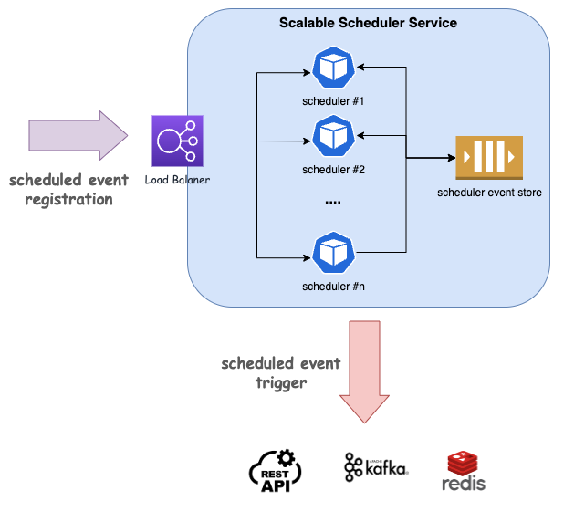

# Scalable Scheduler Service

## Service Overview



This service triggers events according to the schedule information specified by the user, and is intended for use in a cloud environment as well as a local environment.

### Features

- Asynchronous schedule event handling
- Horizontal scalability according to service load
- Schedule recovery when service restarts
- Schedule Event History(Comming soon)


## Setup

### Prerequistes

- python 3.9 or later


### Install the required modules

```bash
pip install -r src/requirements.txt
```

### Prepare ***config.yaml***

copy ***config/config.yaml*** to ***src/*** after modifying it if necessary.


### Start API server

```bash
cd src
python3 main.py
```

### Run test codes.

```bash
cd src
python3 -m unittest discover -s unit_test -p "*_test.py"
```

## Deployment

#### Build a docker image

```bash
# build a docker image
./build.sh

# push the docker image
./push.sh
```


## API Manual

```bash
{URL}:9902/docs

```


### Task Type

- Rest
- Kafka
- Redis


#### Task Rest Example

```json
{
  "name": "cron-test",
  "type": "cron",
  "schedule": "*/1 * * * *",
  "task": {
    "type": "rest",
    "connection": {
      "host": "http://localhost:3000/api/unstable/run-scenario/DELAY-TEST", 
      "headers": {"Content-Type": "application/json", "accept": "*/*"},
      "data": {"instanceName": "delay-test", "variables": {}}
    }
  }
}
```

#### Task Kafka Example

```json
{
  "name": "ap3",
  "type": "now",
  "schedule": "",
  "task": {
    "type": "kafka",
    "connection": {
      "host": "localhost:9092", 
      "topic": "example-topic"},
    "data": {"id": "toboe"}
  }
}
```


## Additional Things

### k8s deployment

Please refer to k8s/*.

### Code Formatter

Black(https://github.com/psf/black)

```bash
pip install black
```